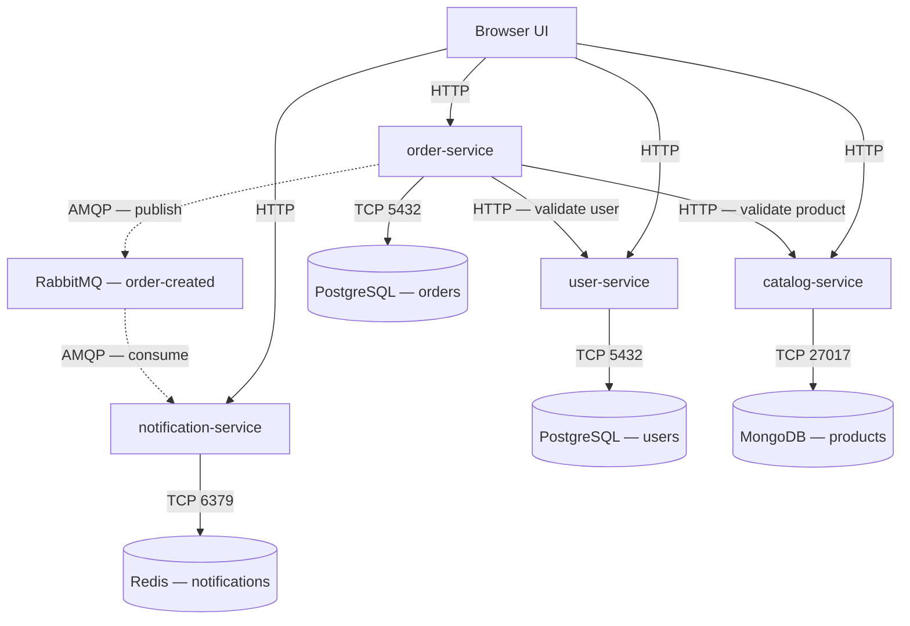

# ShopLite Python Starter

ShopLite is a deliberately small microservices application for the BJIT
platform-engineering assignment. The backend consists of four independent
FastAPI services. The frontend is plain HTML, CSS, and JavaScript served by
`user-service`, so the local environment still contains exactly the nine
containers required by the assignment.

> This repository is a complete BJIT platform-engineering submission: the
> application, Docker Compose environment, CI pipeline, Terraform-provisioned
> Kubernetes cluster, and full Kubernetes deployment are all implemented and
> verified end-to-end.

## Architecture



Each service accesses only its own database. `order-service` uses synchronous
REST calls for information it needs before accepting an order. Notification
delivery is asynchronous, so stopping `notification-service` does not prevent
new orders from being created.

## Repository layout

```text
shoplite/
├── .github/workflows/ci.yml
├── docs/
│   ├── design-decisions.md
│   └── branch-protection.png
├── k8s/                        Namespace, Secret, ConfigMap, databases, services, ingress
├── terraform/
│   ├── main.tf
│   ├── variables.tf
│   ├── outputs.tf
│   └── modules/
│       ├── kind-cluster/
│       └── ingress-controller/
├── services/
│   ├── user-service/          FastAPI + PostgreSQL + browser UI
│   ├── catalog-service/       FastAPI + MongoDB
│   ├── order-service/         FastAPI + PostgreSQL + REST + RabbitMQ publisher
│   └── notification-service/  FastAPI + Redis + RabbitMQ consumer
├── tests/
├── .env.example
├── docker-compose.yml
└── README.md
```

## Prerequisites

- Docker Desktop or Docker Engine with Compose v2
- Git
- Optional for local linting: Python 3.12

No local PostgreSQL, MongoDB, Redis, or RabbitMQ installation is required.

## Start the complete application

Copy the example environment file:

```bash
cp .env.example .env
```

Windows PowerShell:

```powershell
Copy-Item .env.example .env
```

The values in `.env.example` are development placeholders. Change them before
sharing or deploying the project.

Build and start all nine containers:

```bash
docker compose up --build
```

Wait until the four application services report healthy:

```bash
docker compose ps
```

Open:

- Browser application: <http://localhost:8001>
- User API docs: <http://localhost:8001/docs>
- Catalog API docs: <http://localhost:8002/docs>
- Order API docs: <http://localhost:8003/docs>
- Notification API docs: <http://localhost:8004/docs>
- RabbitMQ UI: <http://localhost:15672>

Use the `RABBITMQ_USER` and `RABBITMQ_PASSWORD` values from `.env` for the
RabbitMQ UI.

## API endpoints

| Service | Endpoint | Purpose |
|---|---|---|
| All four | `GET /healthz` | Is the process alive? |
| All four | `GET /readyz` | Can the service reach its own database? |
| User | `POST /users` | Create a user |
| User | `GET /users/{id}` | Get a user |
| Catalog | `POST /products` | Create a product |
| Catalog | `GET /products` | List products |
| Catalog | `GET /products/{id}` | Get a product |
| Order | `POST /orders` | Validate dependencies and create an order |
| Order | `GET /orders/{id}` | Get an order |
| Notification | `GET /notifications/{userId}` | List notifications |

Every route is also available under `/api`, which makes the same service code
compatible with the assignment's planned Kubernetes Ingress paths.

## Command-line demo

Create a user:

```bash
curl -X POST http://localhost:8001/users \
  -H "Content-Type: application/json" \
  -d '{"name":"Amina Rahman","email":"amina@example.com"}'
```

Example response:

```json
{"id":1,"name":"Amina Rahman","email":"amina@example.com"}
```

Create a product:

```bash
curl -X POST http://localhost:8002/products \
  -H "Content-Type: application/json" \
  -d '{"name":"Mechanical keyboard","price":29.99,"attributes":{"layout":"US"}}'
```

Copy the returned product `id`, then create an order:

```bash
curl -X POST http://localhost:8003/orders \
  -H "Content-Type: application/json" \
  -d '{"userId":1,"productId":"PASTE_PRODUCT_ID","quantity":2}'
```

After a moment, read the notification:

```bash
curl http://localhost:8004/notifications/1
```

## Required resilience demonstrations

### Notification service can be unavailable

Stop only the consumer:

```bash
docker compose stop notification-service
```

Create another order. The order still succeeds because RabbitMQ remains
available and stores the durable message. Restart the consumer:

```bash
docker compose start notification-service
```

The queued notification should then appear.

### Catalog failure returns quickly

```bash
docker compose stop catalog-service
```

Try to create an order. `order-service` returns a clean `503` response after at
most approximately three seconds instead of hanging. Restore the service:

```bash
docker compose start catalog-service
```

### Data survives container recreation

Create sample records, then run:

```bash
docker compose down
docker compose up
```

The named volumes preserve users, products, orders, notifications, and queued
RabbitMQ messages. To intentionally remove the data, use
`docker compose down --volumes`.

## Kubernetes deployment

The same application also runs on Kubernetes (a local `kind` cluster,
provisioned with Terraform, fronted by an NGINX Ingress Controller). All
manifests live under `k8s/` and are applied in dependency order.

### Deploy

```bash
cd terraform && terraform init && terraform apply
cd ..
```

Build the application images and load them into the `kind` cluster (kind
nodes don't share your local Docker image cache, so this step is required
even though the images build successfully):

```bash
docker compose build
docker tag shoplite-user-service:latest shoplite/user-service:1.0
docker tag shoplite-catalog-service:latest shoplite/catalog-service:1.0
docker tag shoplite-order-service:latest shoplite/order-service:1.0
docker tag shoplite-notification-service:latest shoplite/notification-service:1.0
kind load docker-image shoplite/user-service:1.0 --name shoplite
kind load docker-image shoplite/catalog-service:1.0 --name shoplite
kind load docker-image shoplite/order-service:1.0 --name shoplite
kind load docker-image shoplite/notification-service:1.0 --name shoplite
```

(Requires the [`kind` CLI](https://kind.sigs.k8s.io/docs/user/quick-start/#installation) — the Terraform `tehcyx/kind` provider manages cluster lifecycle but not image loading.)

```bash
kubectl apply -f k8s/00-namespace.yaml -f k8s/01-secret.yaml -f k8s/02-configmap.yaml
kubectl apply -f k8s/10-user-db.yaml -f k8s/11-order-db.yaml -f k8s/12-catalog-db.yaml -f k8s/13-notification-db.yaml -f k8s/14-rabbitmq.yaml
kubectl apply -f k8s/20-user-service.yaml -f k8s/21-catalog-service.yaml -f k8s/22-order-service.yaml -f k8s/23-notification-service.yaml
kubectl apply -f k8s/30-ingress.yaml -f k8s/31-frontend-ingress.yaml
```

Add `127.0.0.1 shoplite.local` to your hosts file:

- Linux/macOS: `sudo sh -c 'echo "127.0.0.1 shoplite.local" >> /etc/hosts'`
- Windows (PowerShell, run as Administrator): `notepad C:\Windows\System32\drivers\etc\hosts` and add the line manually

Then verify:

```bash
kubectl get pods -n shoplite
curl -i http://shoplite.local/api/users/1
```

Frontend: <http://shoplite.local>

### What's deployed

| Resource | Detail |
|---|---|
| Namespace | `shoplite` |
| Secret | DB/RabbitMQ credentials and assembled connection strings |
| ConfigMap | Non-sensitive settings (timeouts, log level, internal service URLs) |
| Databases | 2× PostgreSQL, MongoDB, Redis — each with a PVC and readiness probe |
| RabbitMQ | 1 replica, PVC-backed |
| Application services | 4 Deployments, 2 replicas each, liveness (`/healthz`) + readiness (`/readyz`) probes, CPU/memory requests and limits |
| Ingress | `shoplite-ingress` routes `/api/*` (with prefix rewrite); `shoplite-frontend-ingress` routes `/` and `/static` — kept separate since the API ingress uses regex rewrite rules that would conflict with plain frontend paths |

### Resilience: database pod recovery

```bash
kubectl delete pod <order-db-pod-name> -n shoplite
kubectl get pods -n shoplite -w
```

Kubernetes recreates the pod automatically — observed recovery time was under
10 seconds, with no manual intervention. `order-service` uses
`pool_pre_ping=True` in its SQLAlchemy engine, so it reconnects on its own once
the database is back.

### Scaling

```bash
kubectl scale deployment order-service --replicas=5 -n shoplite
kubectl get pods -n shoplite -l app=order-service -w
```

All new replicas reached `1/1 Running` within ~12 seconds, with zero
disruption to the existing pods.

### Teardown

```bash
cd terraform
terraform destroy
```

This removes the `kind` cluster and the ingress controller release entirely.
Re-running `terraform apply` afterward rebuilds both from scratch (verified:
`terraform plan` reports no differences after a clean apply).

### Branch protection

`main` and `develop` are both protected: pull requests are required, the
`Lint (ruff)` and `Test (pytest)` CI checks must pass, and force pushes are
blocked.

## Run lint and tests locally

Create a virtual environment and install only the development tools:

```bash
python -m venv .venv
```

Linux/macOS:

```bash
source .venv/bin/activate
python -m pip install -r requirements-dev.txt
ruff check services tests
pytest
```

Windows PowerShell:

```powershell
.\.venv\Scripts\Activate.ps1
python -m pip install -r requirements-dev.txt
ruff check services tests
pytest
```

The GitHub Actions workflow performs syntax checking, linting, and tests on
pull requests to `develop` and `main`.

## Configuration

Application settings come from environment variables. Database hostnames in
Compose are Docker service names, not `localhost`.

| Setting | Used by | Meaning |
|---|---|---|
| `DATABASE_URL` | User, Order | SQLAlchemy PostgreSQL connection |
| `MONGO_URI` | Catalog | Authenticated MongoDB connection |
| `REDIS_URL` | Notification | Authenticated Redis connection |
| `RABBITMQ_URL` | Order, Notification | AMQP connection |
| `USER_SERVICE_URL` | Order | Internal user API address |
| `CATALOG_SERVICE_URL` | Order | Internal catalog API address |
| `HTTP_TIMEOUT_SECONDS` | Order | Outbound REST timeout |
| `NOTIFICATION_TTL_SECONDS` | Notification | Redis notification expiry |

## Troubleshooting

### A service starts before its database

Compose database health checks and `depends_on` conditions prevent the normal
startup race. Each service also retries its initial database connection.

### A port is already in use

Stop the application occupying ports `8001`–`8004` or `15672`, or change only
the host side of the port mapping in `docker-compose.yml`.

### The UI reports that a service is unavailable

Run:

```bash
docker compose ps
docker compose logs --tail=100 SERVICE_NAME
```

Use `/healthz` to check the process and `/readyz` to check its database.

### Old data causes confusing results

This removes local development data and cannot be undone:

```bash
docker compose down --volumes
```

Then rebuild with `docker compose up --build`.

### Pods show `ErrImagePull` or `ImagePullBackOff` in Kubernetes

`docker compose build` tags images as `shoplite-<service>:latest`, but the
Kubernetes manifests expect `shoplite/<service>:1.0`. Retag and load into
`kind` as shown in the Deploy section above. Confirm the exact image/tag a
manifest expects with:

```bash
kubectl get deployment SERVICE_NAME -n shoplite -o jsonpath="{.spec.template.spec.containers[0].image}"
```

### `ingress-nginx-controller` pod stuck `Pending`

Caused by a scheduling conflict: the controller's `nodeSelector`
(`ingress-ready=true`) only matches the control-plane node, but the
control-plane's default taint blocks scheduling there. The Helm release in
`terraform/modules/ingress-controller/main.tf` includes a toleration for
`node-role.kubernetes.io/control-plane` to resolve this — confirm with
`kubectl describe pod -n ingress-nginx -l app.kubernetes.io/component=controller`
if it recurs.

## Assignment status

All required components are implemented and deployed:

- Docker Compose local environment (9 containers)
- Terraform-provisioned `kind` cluster with NGINX Ingress
- Full Kubernetes application layer (Namespace, Secret, ConfigMap, PVCs,
  Deployments, Services, Ingress) — see "Kubernetes deployment" above
- Resilience and scaling demonstrations captured
- Multiple feature/fix/docs pull requests merged into develop via a CI-gated, branch-protected workflow
- Synchronous REST (user/product validation) and asynchronous messaging
  (order → RabbitMQ → notification) both verified end-to-end through the
  Ingress