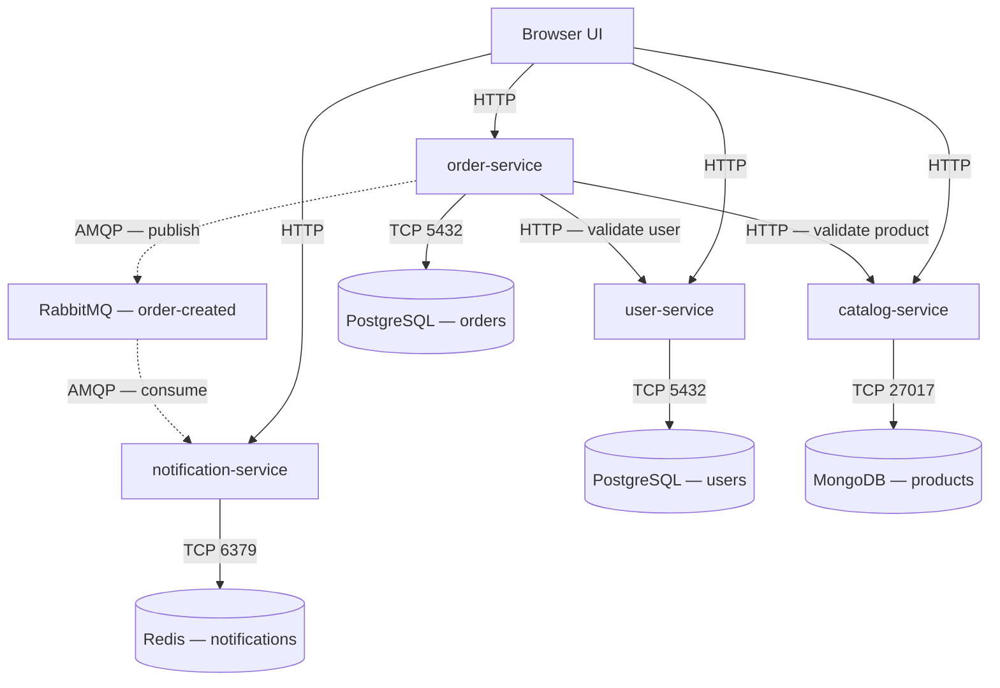

# ShopLite Python Starter

ShopLite is a deliberately small microservices application for the BJIT
platform-engineering assignment. The backend consists of four independent
FastAPI services. The frontend is plain HTML, CSS, and JavaScript served by
`user-service`, so the local environment still contains exactly the nine
containers required by the assignment.

> This ZIP completes the **application, Docker Compose, basic CI, and
> documentation starter**. The Terraform modules and Kubernetes manifests are
> intentionally left for the infrastructure phase of the assignment.

## Architecture



Each service accesses only its own database. `order-service` uses synchronous
REST calls for information it needs before accepting an order. Notification
delivery is asynchronous, so stopping `notification-service` does not prevent
new orders from being created.

## Repository layout

```text
shoplite-python-starter/
├── .github/workflows/ci.yml
├── docs/design-decisions.md
├── services/
│   ├── user-service/          FastAPI + PostgreSQL + browser UI
│   ├── catalog-service/       FastAPI + MongoDB
│   ├── order-service/         FastAPI + PostgreSQL + REST + RabbitMQ publisher
│   └── notification-service/  FastAPI + Redis + RabbitMQ consumer
├── tests/
├── .env.example
├── docker-compose.yml
└── README.md
```

## Prerequisites

- Docker Desktop or Docker Engine with Compose v2
- Git
- Optional for local linting: Python 3.12

No local PostgreSQL, MongoDB, Redis, or RabbitMQ installation is required.

## Start the complete application

Copy the example environment file:

```bash
cp .env.example .env
```

Windows PowerShell:

```powershell
Copy-Item .env.example .env
```

The values in `.env.example` are development placeholders. Change them before
sharing or deploying the project.

Build and start all nine containers:

```bash
docker compose up --build
```

Wait until the four application services report healthy:

```bash
docker compose ps
```

Open:

- Browser application: <http://localhost:8001>
- User API docs: <http://localhost:8001/docs>
- Catalog API docs: <http://localhost:8002/docs>
- Order API docs: <http://localhost:8003/docs>
- Notification API docs: <http://localhost:8004/docs>
- RabbitMQ UI: <http://localhost:15672>

Use the `RABBITMQ_USER` and `RABBITMQ_PASSWORD` values from `.env` for the
RabbitMQ UI.

## API endpoints

| Service | Endpoint | Purpose |
|---|---|---|
| All four | `GET /healthz` | Is the process alive? |
| All four | `GET /readyz` | Can the service reach its own database? |
| User | `POST /users` | Create a user |
| User | `GET /users/{id}` | Get a user |
| Catalog | `POST /products` | Create a product |
| Catalog | `GET /products` | List products |
| Catalog | `GET /products/{id}` | Get a product |
| Order | `POST /orders` | Validate dependencies and create an order |
| Order | `GET /orders/{id}` | Get an order |
| Notification | `GET /notifications/{userId}` | List notifications |

Every route is also available under `/api`, which makes the same service code
compatible with the assignment's planned Kubernetes Ingress paths.

## Command-line demo

Create a user:

```bash
curl -X POST http://localhost:8001/users \
  -H "Content-Type: application/json" \
  -d '{"name":"Amina Rahman","email":"amina@example.com"}'
```

Example response:

```json
{"id":1,"name":"Amina Rahman","email":"amina@example.com"}
```

Create a product:

```bash
curl -X POST http://localhost:8002/products \
  -H "Content-Type: application/json" \
  -d '{"name":"Mechanical keyboard","price":29.99,"attributes":{"layout":"US"}}'
```

Copy the returned product `id`, then create an order:

```bash
curl -X POST http://localhost:8003/orders \
  -H "Content-Type: application/json" \
  -d '{"userId":1,"productId":"PASTE_PRODUCT_ID","quantity":2}'
```

After a moment, read the notification:

```bash
curl http://localhost:8004/notifications/1
```

## Required resilience demonstrations

### Notification service can be unavailable

Stop only the consumer:

```bash
docker compose stop notification-service
```

Create another order. The order still succeeds because RabbitMQ remains
available and stores the durable message. Restart the consumer:

```bash
docker compose start notification-service
```

The queued notification should then appear.

### Catalog failure returns quickly

```bash
docker compose stop catalog-service
```

Try to create an order. `order-service` returns a clean `503` response after at
most approximately three seconds instead of hanging. Restore the service:

```bash
docker compose start catalog-service
```

### Data survives container recreation

Create sample records, then run:

```bash
docker compose down
docker compose up
```

The named volumes preserve users, products, orders, notifications, and queued
RabbitMQ messages. To intentionally remove the data, use
`docker compose down --volumes`.

## Run lint and tests locally

Create a virtual environment and install only the development tools:

```bash
python -m venv .venv
```

Linux/macOS:

```bash
source .venv/bin/activate
python -m pip install -r requirements-dev.txt
ruff check services tests
pytest
```

Windows PowerShell:

```powershell
.\.venv\Scripts\Activate.ps1
python -m pip install -r requirements-dev.txt
ruff check services tests
pytest
```

The GitHub Actions workflow performs syntax checking, linting, and tests on
pull requests to `develop` and `main`.

## Configuration

Application settings come from environment variables. Database hostnames in
Compose are Docker service names, not `localhost`.

| Setting | Used by | Meaning |
|---|---|---|
| `DATABASE_URL` | User, Order | SQLAlchemy PostgreSQL connection |
| `MONGO_URI` | Catalog | Authenticated MongoDB connection |
| `REDIS_URL` | Notification | Authenticated Redis connection |
| `RABBITMQ_URL` | Order, Notification | AMQP connection |
| `USER_SERVICE_URL` | Order | Internal user API address |
| `CATALOG_SERVICE_URL` | Order | Internal catalog API address |
| `HTTP_TIMEOUT_SECONDS` | Order | Outbound REST timeout |
| `NOTIFICATION_TTL_SECONDS` | Notification | Redis notification expiry |

## Troubleshooting

### A service starts before its database

Compose database health checks and `depends_on` conditions prevent the normal
startup race. Each service also retries its initial database connection.

### A port is already in use

Stop the application occupying ports `8001`–`8004` or `15672`, or change only
the host side of the port mapping in `docker-compose.yml`.

### The UI reports that a service is unavailable

Run:

```bash
docker compose ps
docker compose logs --tail=100 SERVICE_NAME
```

Use `/healthz` to check the process and `/readyz` to check its database.

### Old data causes confusing results

This removes local development data and cannot be undone:

```bash
docker compose down --volumes
```

Then rebuild with `docker compose up --build`.

## Remaining assignment work

Before treating this as the finished BJIT submission, the assignee should:

1. Add the two Terraform modules that create a `kind` cluster and install the
   ingress controller.
2. Add Kubernetes Namespace, Deployments, Services, PVCs, ConfigMap, Secret,
   and Ingress manifests.
3. Load the four locally built images into `kind`.
4. Capture scaling and database-pod failure evidence.
5. Create the required feature branches and pull requests rather than
   submitting the generated files as one commit.
6. Replace this starter's generic troubleshooting examples with issues
   actually encountered during implementation.

The assignee should read and explain the code before presenting it. The review
is designed to test reasoning and debugging, not merely file completeness.

